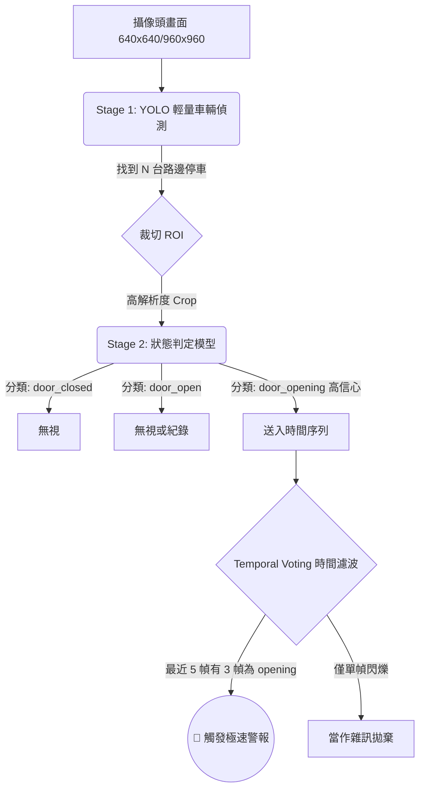

# 3 公尺車門預警系統：架構藍圖與實作總結 (Plan C)

我們已經採用雙管齊下的「方案 C」，為你完成了短期的止血擴增，並為未來的邊緣運算準備好這份中長期戰略設計圖。

---

## 🛠️ 第一階段：軟體即時擴增補強 (已完工)

為了讓現有的 YOLO 模型能優先具備更佳的小目標感知能力，我們已對程式碼進行以下修改：

1.  **類別定義轉移 (`dataset.yaml`)**：擴增為 `door_closed`、`door_opening`、`door_open` 三類，明確宣示 `door_opening` 就是未來標註的主力與防護核心。
2.  **拉高解析度上限 (`train_config.yaml`)**：預設輸入 `imgsz` 調高至 960，這是小目標最暴力的解法。
3.  **解除小框誤殺 (`augment_dataset.py`)**：將所有流水線的 `min_area` 從 1024 降至 64，現在遠方車門就算被縮得很小，這組特徵也會被保留進訓練庫。
4.  **新增 `far_scale` 預設管線 (`augment_dataset.py`)**：加入了純粹的退縮/縮放增強（Scale-out），讓遠方物體變小但不加極端塗抹，讓神經網路學習微弱的高頻特徵。

---

## 🏗️ 第二階段：兩階段遠距預警架構圖 (Architecture Blueprint)

如果要在單車上用 Jetson 這類算力有限的裝置，即時扛住「3公尺遠」且「視角廣」的物理極限，你未來的推論管道 (Inference Pipeline) 應該長這樣：

### Stage 1: 整圖全景（大目標）偵測
*   **用途**：找出「路邊的車」和「人」。因為即使在 3 公尺外，車輛的輪廓也足夠大，YOLOv8n 用 640 就能每秒跑出 60+ FPS。
*   **作法**：不需要找門，只需標記車輛 bbox。

### Stage 2: 門縫區域（微目標）放大分析
*   **用途**：這是解決「硬體解析度不夠」的終極大絕招。
*   **作法**：將 Stage 1 圈出來的每一輛車的區塊（ROI），放大填滿成 224x224，再送入第二層網路（可以是很輕的分類模型，或是另一個極小版的 YOLO 分類器）來判斷 `door_opening`。原本在全圖只佔 10 像素的門縫，因為先被裁切，等於被硬體**無損光學變焦**了。

### Temporal Voting (時間平滑)
*   **防錯機制**：車門縫實在太難判斷（可能是電線桿反光、可能是車燈），如果單幀觸發就煞車，騎士會崩潰。你需要一個 `collections.deque(maxlen=5)`，當歷史 5 幀中有 3 幀都覺得在開門，才真正拉響警報。

---

## 📏 專案下一代的資料與硬體指引

### 1. 資料距離分桶準則 (Distance Buckets)
當你要準備下一批訓練集時，**請絕對不要把它們混為一談**。你要在人工切資料夾，或者標籤命名時，帶入這個維度：
*   **`near.txt`**：0~1m (車門佔畫面大於 1/4)
*   **`mid.txt`**：1~2.5m (可見清楚手部與門緣)
*   **`far_opening.txt`**：>3m (**這是你的魔王關**，這批資料要用來特別監測模型在預警距離的 Recall 是否掉線)

### 2. 攝影鏡頭 FOV 建議
不要用市售 150 度~170 度的超廣角鏡！超廣角會造成強烈的空間扭曲與邊緣物件縮水。
建議：
1.  **視野收斂**：改用 100~120 度的中廣角，犧牲天空與對向車道，換取車側像素密度的極限提升。
2.  **安裝偏位**：鏡頭別瞄準道路正中心，稍微向「右側（車輛停放側）」偏移 10~15 度。
